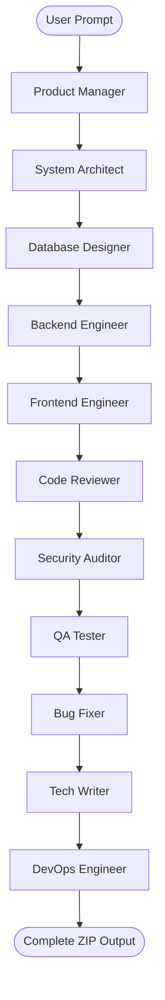

# CodeSmith AI – Autonomous Multi-Agent Software Engineering Team

CodeSmith AI is an autonomous, stateful, multi-agent software engineering platform built with **LangGraph**, **FastAPI**, and **React + Vite + Tailwind CSS**. It simulates a complete software development company where specialized, state-contained agents collaborate through a single shared state to transform a natural-language prompt into a production-ready application.

## 🚀 Features

- **Multi-Agent Collaboration**: Orchestrates 11 specialized roles (Product Manager, Architect, DB Designer, Backend Engineer, Frontend Engineer, Code Reviewer, Security Auditor, QA Tester, Bug Fixer, Tech Writer, and DevOps Engineer) in a sequential LangGraph pipeline.
- **Stateful Workflow Orchestration**: Uses LangGraph's shared state pattern to pass context between agents. No agent communicates directly with another; all state modifications are checked and merged through `ProjectState`.
- **Structured LLM Outputs**: Enforces strict Pydantic schemas using model-level structured outputs to parse agent results reliably.
- **Multi-LLM Routing**: Automatically routes tasks to optimal LLMs (Gemini, Groq, Mistral) based on task needs.
- **WebSocket Streaming**: Stream agent progress, active logs, and status updates to the client in real-time.
- **Downloadable Archives**: Automatically builds folder structures for generated projects and packages them as downloadable ZIP archives.

---

## 🛠️ Architecture Workflow



---

## 📂 Project Structure

```
CodeSmith AI/
├── backend/
│   ├── app/
│   │   ├── agents/          # Specialized agent packages (PM, Architect, etc.)
│   │   ├── api/             # REST routes and WebSocket streaming
│   │   ├── core/            # BaseAgent, BaseLLMAgent, Providers definition
│   │   ├── database/        # DB configuration placeholders
│   │   ├── graph/           # LangGraph builder, state, and routing rules
│   │   ├── guardrails/      # Output validators and parser logic
│   │   ├── llms/            # Individual model drivers (Gemini, Groq, Mistral)
│   │   └── services/        # Disk writes, ZIP generation, workflow manager
│   ├── main.py              # FastAPI application server entrypoint
│   └── test_graph.py        # Pipeline dry-run script
├── frontend/
│   ├── src/
│   │   ├── components/      # UI Elements (ProjectForm, ProgressBar, OutputViewer)
│   │   ├── App.jsx          # Dashboard layout & WebSocket orchestration
│   │   └── index.css        # Tailwind v4 theme styling
│   ├── package.json
│   └── vite.config.js
├── docker/                  # Empty placeholder folder for runtime outputs
├── docker-compose.yml       # Production Compose orchestrator
└── README.md                # System documentation
```

---

## ⚡ Quickstart

### Prerequisite Environment Configuration

Create a `.env` file inside `backend/`:
```env
GEMINI_API_KEY=your_gemini_key
GROQ_API_KEY=your_groq_key
MISTRAL_API_KEY=your_mistral_key
```

### Option A: Local Development

#### 1. Backend Setup
```bash
cd backend
python -m venv .venv
source .venv/bin/activate  # Or `.venv\Scripts\activate` on Windows
pip install -r requirements.txt
uvicorn main:app --reload --port 8000
```

#### 2. Frontend Setup
```bash
cd frontend
npm install
npm run dev
```
Open [http://localhost:5173](http://localhost:5173) in your browser.

### Option B: Docker Compose
```bash
docker-compose up --build
```
- Frontend: [http://localhost:3000](http://localhost:3000)
- Backend: [http://localhost:8000](http://localhost:8000)

---

## 📈 Verification

To verify that the multi-agent graph builder runs correctly without starting the API server, execute the mock workflow runner:
```bash
cd backend
.venv/bin/python test_graph.py
```
