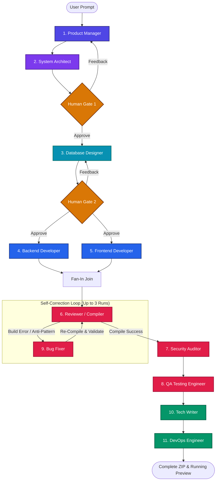

# 🛠️ CodeSmith AI
### *Autonomous Multi-Agent Software Engineering Platform*

<p align="center">
  
  
  
  
</p>

---

## 🌌 Overview

**CodeSmith AI** is an autonomous, stateful, multi-agent software engineering team that simulates a complete software development organization. Guided by a single natural language prompt, **11 specialized AI agents** collaborate through a shared state machine to build, compile, review, secure, test, and document production-ready full-stack applications.

Unlike naive code generation scripts, CodeSmith AI integrates a **real-time compilation feedback loop**. If a generated application contains import bugs or syntax errors, the review engine intercepts the build logs and instructs the Bug Fixer agent to patch the code autonomously before shipping it to the client.

---

## 🧠 System Architecture & Agent Flow

CodeSmith AI is powered by a **LangGraph state machine**. Rather than passing large context dumps directly between agents, all information is structured in a central `ProjectState` database.



---

## 👥 Meet the Team (The 11 Agents)

| Role | Agent ID | Responsibilities | Output Artifact |
| :--- | :--- | :--- | :--- |
| **Product Manager** | `PM` | Translates user prompts into features, users, and core requirements. | `requirements.json` |
| **System Architect** | `Architect` | Defines component design, api endpoint design, and technical stack. | `architecture.json` |
| **Database Designer** | `DatabaseDesigner` | Architect database schemas, tables, relationships, and migration SQL scripts. | `database_schema.json` |
| **Backend Developer** | `BackendEngineer` | Generates main app server, routes, services, models, and dependencies. | `backend_code` (`extra_files`) |
| **Frontend Developer** | `FrontendEngineer` | Creates UI dashboard, state logic, stylesheets, and custom components. | `frontend_code` (`components/`) |
| **Code Reviewer** | `Reviewer` | Runs **real-world build compilation checks** and rates structural quality. | `review_report.json` |
| **Security Auditor** | `SecurityExpert` | Performs automated static analysis for OWASP risks and secret leaks. | `security_report.json` |
| **QA Testing Engineer** | `QAEngineer` | Automatically creates backend unit/integration tests and frontend components tests. | `testing_report.json` |
| **Bug Fixer** | `BugFixer` | Consumes compiler logs and auditor concerns to apply source code patches. | `bugfix_report.json` |
| **Tech Writer** | `TechWriter` | Documents setup guides, architecture layouts, and API references. | `README.md`, `docs/` |
| **DevOps Engineer** | `DevOps` | Creates Docker configs, docker-compose orchestration, and CI/CD pipelines. | `docker-compose.yml`, `ci.yml` |

---

## ⚡ Key Upgrades & Resilience Systems

### 🔄 The Automated Compiler Loop
To prevent broken code, CodeSmith AI integrates a validation module directly in the review step:
* **Dynamic Scaffolding:** Writes generated files to a temporary workspace under `generated_projects/{job_id}/`.
* **Frontend Build Check:** Resolves dependencies using `npm install` and triggers `npm run build` with Vite.
* **Backend Syntax Check:** Runs `py_compile` on the generated Python files (or build tools for other languages) to catch import anomalies and structural bugs.
* **Autonomous Remediation:** If a build fails (e.g. `Failed to resolve import "../apiClient"`), the error logs are injected directly into the **Bug Fixer**'s prompt to compile a clean patch.

### 📁 Workspace File Explorer UI
The React frontend has been upgraded with a developer-first **Workspace File Explorer**. Instead of dumping unstructured JSON blobs, the output dashboard lets you browse files in an IDE-style workspace:
* Fully browse backend entry points, API routes, models, configuration files, and middleware directories.
* Explore frontend components, style configurations, entry-point scripts, and HTML files.
* Single-click copying for individual files or download the entire project as a ZIP archive.

---

## 📂 Project Structure

```ascii
CodeSmith AI/
│
├── backend/
│   ├── app/
│   │   ├── agents/          # Specialized agent definitions (PM, Architect, Reviewer, etc.)
│   │   ├── api/             # HTTP REST controllers and real-time WebSocket stream
│   │   ├── core/            # Fallback providers and LLM execution engine
│   │   ├── database/        # SQLite job storage & SQLAlchemy ORM
│   │   ├── graph/           # LangGraph builder, shared state, and routing rules
│   │   ├── guardrails/      # Schema conformance checks
│   │   ├── llms/            # Drivers for Gemini, Groq, and Mistral
│   │   └── services/        # Disk writers, build compiler validation, preview server
│   │
│   ├── main.py              # FastAPI server entry point (configured with lifespan hooks)
│   └── test_graph.py        # Command-line testing harness for graph runs
│
├── frontend/
│   ├── src/
│   │   ├── components/      # ProjectForm, ProgressBar, and OutputExplorer components
│   │   ├── App.jsx          # WebSocket listener & dashboard state controller
│   │   └── index.css        # Tailwind CSS import styles & custom keyframes
│   │
│   ├── package.json         # Client dependencies
│   └── vite.config.js       # Vite bundler options
│
└── README.md                # System documentation
```

---

## 🚀 Getting Started

### 📋 Prerequisites
* **Node.js** (v18 or higher)
* **Python** (3.10 or higher)
* API Keys for LLM Providers (Gemini, Groq, or Mistral)

### 🗝️ Environment Settings
Create a `.env` file inside `backend/`:
```env
GEMINI_API_KEY=your_gemini_api_key_here
GROQ_API_KEY=your_groq_api_key_here
MISTRAL_API_KEY=your_mistral_api_key_here
```

### 💻 Local Run

#### 1. Start the Backend Server
```bash
cd backend
python -m venv .venv
source .venv/bin/activate  # On Windows use: .venv\Scripts\activate
pip install -r requirements.txt
uvicorn main:app --reload --port 8000
```

#### 2. Start the Frontend Dashboard
```bash
cd frontend
npm install
npm run dev
```
Open [http://localhost:5173](http://localhost:5173) in your browser.

---

## 🐳 Docker Deployment

To spin up the entire application stack using Docker Compose:
```bash
docker-compose up --build
```
* **Frontend:** [http://localhost:3000](http://localhost:3000)
* **Backend:** [http://localhost:8000](http://localhost:8000)

---

## 🧪 Pipeline Dry Run

You can dry-run the LangGraph state machine in terminal mode to verify your keys and agent routing without launching the web server:
```bash
cd backend
.venv/bin/python test_graph.py
```

---

> [!TIP]
> **Resiliency Tip:** If `npm install` fails inside a generated app due to conflicts between package versions, the preview engine will automatically run a fallback installer with `--legacy-peer-deps` to guarantee the preview server successfully starts.
